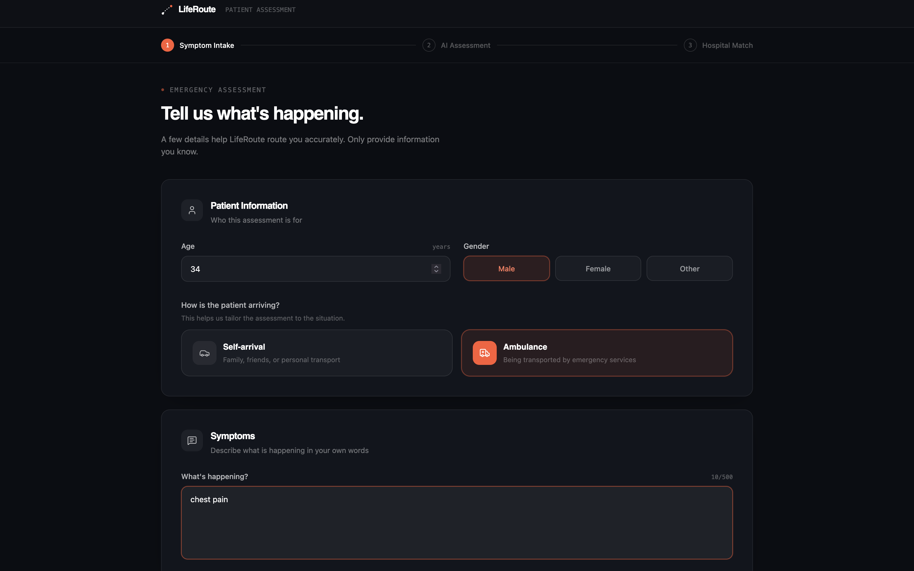
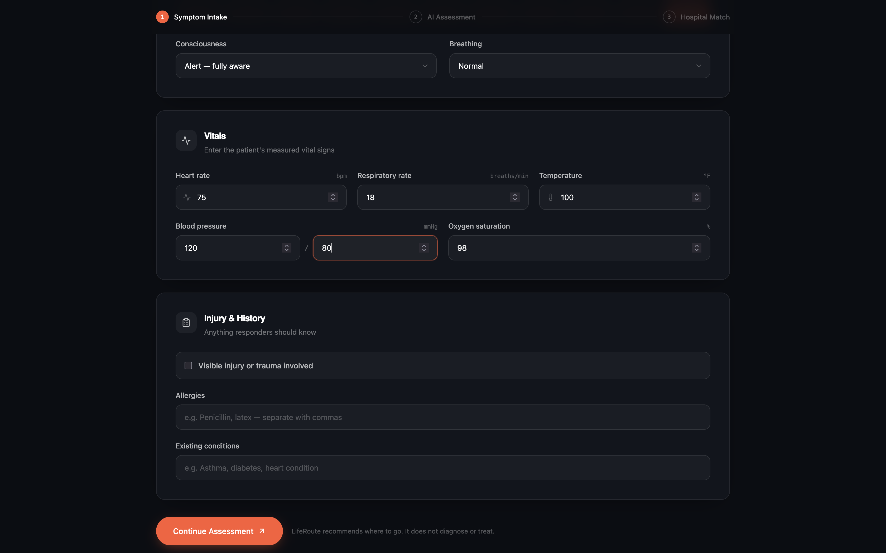
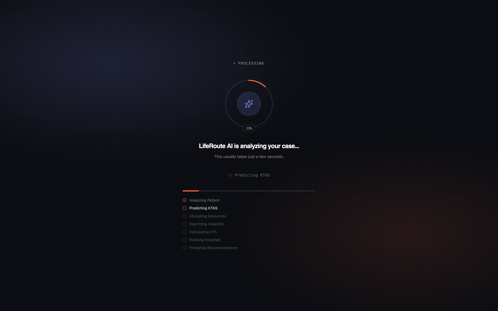

<div align="center">

# 🚑 LifeRoute

### AI-Powered Emergency Triage & Intelligent Hospital Routing Platform

**The Right Care. At The Right Time.**

LifeRoute is an AI-assisted emergency healthcare platform that evaluates a patient's emergency condition, predicts the medical resources they may require, and recommends a suitable hospital based on **medical resource compatibility, hospital availability, distance, and estimated travel time**.

<br>


</div>

<br>

## 📌 Overview

During a medical emergency, the nearest hospital is not always the most suitable one. A patient may need a specific specialist, ICU support, a ventilator, or trauma care that isn't available at the closest facility.

**LifeRoute solves this through resource-aware emergency routing.**

Instead of asking *"which hospital is closest?"*, LifeRoute asks:

> **"Which suitable hospital can provide the resources this patient needs, while remaining reasonably accessible?"**

It combines emergency assessment, KTAS-based triage, medical resource prediction, hospital capability matching, and route estimation into one workflow.

<br>

## 🎯 Problem Statement

Traditional hospital-finder systems prioritize proximity without checking whether a hospital can actually treat the patient's condition. This leads to:

- Patients routed to unsuitable facilities
- Delays caused by hospital transfers
- Difficulty locating the right specialists
- Inefficient emergency resource allocation
- Slower decision-making during emergencies

<br>

## 💡 Our Solution

```
Patient → Emergency Assessment → KTAS Triage → Medical Category Detection
   → Resource Prediction → Hospital Capability Matching
   → Distance & ETA Calculation → Hospital Ranking → Recommended Hospital
```

The system evaluates the patient's condition, identifies required resources, matches them against hospital capabilities, then factors in accessibility before recommending a hospital.

<br>

## ✨ Core Features

**🧠 AI-Assisted Emergency Assessment** — Takes chief complaint, heart rate, SpO₂, systolic BP, respiratory rate, and location as input.

**🚑 KTAS-Based Triage** — Determines emergency severity, feeding into resource prediction. Higher-acuity cases can trigger ICU, Emergency Physician, or Trauma Team requirements.

**🩺 Medical Complaint Classification**

| Category | Example Complaints |
|---|---|
| Cardiology | Chest pain, palpitations, syncope |
| Neurology | Seizure, headache, dizziness, head trauma |
| Respiratory | Dyspnea, shortness of breath |
| Trauma | Open wound, burn, heavy bleeding |
| Orthopedic | Fracture, arm/leg pain |
| Gastrointestinal | Abdominal pain, vomiting |
| Ophthalmology | Ocular pain |
| ENT | Throat pain |
| Infectious | Fever |
| Critical Emergency | High-acuity conditions |

**🧬 Medical Resource Prediction**

```
Chest Pain        → Cardiology   → ECG, Cardiologist, Cardiac Monitoring
Seizure           → Neurology    → CT Scan, Neurologist, ICU
Shortness of Breath → Respiratory → Oxygen, Ventilator, Pulmonologist
Heavy Bleeding    → Trauma       → Trauma Team, General Surgeon, Blood Bank
Fracture          → Orthopedic   → X-Ray, Orthopedic Surgeon
```

**❤️ Vital-Sign-Based Resource Detection**

| Vital Sign | Additional Resource |
|---|---|
| SpO₂ < 90% | Oxygen, Ventilator, ICU |
| Systolic BP < 90 | ICU, Emergency Physician |
| Heart Rate > 120 | Cardiac Monitoring |
| Respiratory Rate > 24 | Emergency Physician |

So the system reacts to the patient's physiological state, not just their stated complaint.

**🏥 Intelligent Hospital Matching** — Compares required resources against hospital capabilities, specialists, operational status, distance, and ETA stored in Firestore.

<br>

## 🎯 Resource-First Hospital Ranking

> The nearest hospital is not automatically the best hospital.

```
Final Score = Resource Match × 70%  +  ETA Score × 25%  +  Open Status × 5%
```

**Example** — A patient needs a Cardiologist, ECG, and Cardiac Monitoring:

```
   Hospital A (5 km)         Hospital B (11 km)
   ❌ Cardiologist            ✅ Cardiologist
   ❌ Required resource       ✅ ECG, Cardiac Monitoring
          │                          │
          └──────────┬───────────────┘
                      ▼
              LifeRoute Ranking → Hospital B recommended
```

<br>

## 🗺️ Route & ETA Estimation

LifeRoute uses **OpenRouteService** for driving distance, travel time, and route-based ETA, with a local geographic fallback if the external service is unavailable.

<br>

## 🔐 Authentication

LifeRoute uses **Firebase Authentication** with separate workflows for **Patients** and **Hospitals**. The backend verifies Firebase tokens before any protected operation.

<br>

## 👤 Patient Workflow

```
Registration → Login → Emergency Assessment → AI Processing
  → KTAS Prediction → Resource Prediction → Hospital Recommendation
  → Hospital Details → Route / Navigation
```

<br>

## 🏥 Hospital Portal

Stores hospital name, address, phone, location, emergency department status, available beds, ICU/ventilator counts, specialists, resources, hospital type, emergency level, and operational status — all in Firestore.

<br>

## 🧠 AI / Decision Pipeline

| Stage | Description |
|---|---|
| 1. Patient Input | Chief complaint, vitals, location |
| 2. KTAS Prediction | Assessment → severity level |
| 3. Medical Category Detection | Complaint → category |
| 4. Resource Prediction | Category + vitals + KTAS → required resources |
| 5. Hospital Matching | Required resources vs. hospital capabilities |
| 6. Route Calculation | Distance + driving ETA |
| 7. Hospital Ranking | Resource match + ETA + status → final score |
| 8. Recommendation | Highest-ranked suitable hospital returned |

<br>

## 🏗️ System Architecture

```
Patient → React + Vite Frontend → REST API → FastAPI Backend
                                                   │
                        ┌──────────────┬───────────────┬──────────────┐
                        ▼              ▼                ▼
                  KTAS Engine   Resource Engine   Firebase Firestore
                        └──────────────┴───────────────┘
                                        ▼
                              Hospital Match & Ranking
                                        ▼
                            OpenRouteService (Distance/ETA)
                                        ▼
                              Recommended Hospital
```

<br>

## 🗄️ Database Architecture

```
Firebase
├── Authentication
└── Cloud Firestore
    ├── patients   → patient application profiles
    ├── hospitals  → hospital info used by the recommendation engine
    └── users      → application-level roles/profiles
```

<br>

## 🤖 AI Components

```
backend/ai/
├── predictor.py                     — emergency severity prediction
├── hospital_engine/
│   └── hospital_ranker.py           — evaluates & ranks candidate hospitals
└── resource_engine/
    ├── category_resources.py        — category → resources
    ├── medical_categories.py        — complaint → category
    ├── ktas_rules.py                — KTAS severity → resources
    └── vital_rules.py               — abnormal vitals → resources
```

<br>

## 📊 Demonstration Hospital Dataset

`backend/data/hospitals_seed.json` — 19 hospitals covering Chandigarh, Mohali, Kharar, Gharuan, Bathinda, Patiala, Amritsar, Jalandhar, Hoshiarpur, and Pathankot.

> ⚠️ **Disclaimer:** Hospital identity/public info is drawn from public sources where possible, but **beds, ICU, ventilator, resource, specialist, and operational status values are prototype/simulated** and must not be treated as real-time data. A production system would need verified, continuously updated hospital feeds.

<br>

## 🧪 Example Scenario

**Input:** Chest Pain · HR 130 BPM · SpO₂ 96% · BP 120 mmHg · RR 20/min

**Category:** Cardiology → **Predicted resources:** ECG, Cardiologist, Cardiac Monitoring (elevated HR reinforces cardiac monitoring)

**Result:** Hospitals are compared and ranked by Resource Match + Travel ETA + Hospital Status.

<br>

## 📸 Application Screenshots

<table>
<tr>
<td width="50%">

**🏠 Landing Page**
<br>


</td>
<td width="50%">

**🔐 Patient Sign In**
<br>


</td>
</tr>
<tr>
<td width="50%">

**🏥 Hospital Sign In**
<br>


</td>
<td width="50%">

**📝 Patient Assessment**
<br>


</td>
</tr>
<tr>
<td width="50%">

**📝 Patient Assessment (cont.)**
<br>


</td>
<td width="50%">

**🤖 AI Processing**
<br>


</td>
</tr>
<tr>
<td width="50%">

**🎯 Hospital Recommendation**
<br>


</td>
<td width="50%">

**🏥 Hospital Details**
<br>


</td>
</tr>
<tr>
<td width="50%">

**📊 Hospital Dashboard**
<br>


</td>
<td width="50%"></td>
</tr>
</table>

<br>

## 🛠️ Technology Stack

**Frontend:** React · Vite · React Router · Tailwind CSS · Framer Motion · Lucide React · Axios

**Backend:** Python · FastAPI · Pydantic · Uvicorn

**AI / Decision Engine:** KTAS-based triage · complaint classification · rule-based resource prediction · vital-sign detection · hospital matching & ranking

**Database:** Firebase · Cloud Firestore · Firebase Admin SDK

**Auth:** Firebase Authentication

**Routing:** OpenRouteService API · Browser Geolocation API

**Deployment:** Vercel (frontend) · Render (backend) · Firebase

<br>

## 📂 Project Structure

```
LifeRoute/
├── backend/
│   ├── ai/
│   │   ├── hospital_engine/hospital_ranker.py
│   │   ├── resource_engine/ (category_resources.py, medical_categories.py, ktas_rules.py, vital_rules.py)
│   │   └── predictor.py
│   ├── app/ (api, core, database, models, services)
│   ├── data/hospitals_seed.json
│   ├── firebase_key.json      # never commit
│   └── requirements.txt
├── frontend/
│   ├── public/
│   └── src/ (components, context, hooks, pages, routes, services)
├── docs/Screenshots/
├── .gitignore
└── README.md
```

<br>

## 🚀 Getting Started

### Prerequisites
Node.js · npm · Python 3.10+ · Git · a Firebase project (Auth + Firestore) · an OpenRouteService API key

### Clone
```bash
git clone https://github.com/Saiyam-Kumar/LifeRoute.git
cd LifeRoute
```

### Backend Setup
```bash
cd backend
python -m venv .venv
source .venv/bin/activate
pip install -r requirements.txt
```

Configure `FIREBASE_CREDENTIALS` and `ORS_API_KEY` locally or via your hosting platform's secret manager. **Never commit** `.env`, `firebase_key.json`, or any credential file.

Run it:
```bash
uvicorn app.main:app --reload
```
Backend: `http://127.0.0.1:8000` · Swagger docs: `http://127.0.0.1:8000/docs`

### Frontend Setup
```bash
cd frontend
npm install
npm run dev
```
Configure Firebase and the backend API URL through your frontend environment file, then open the local URL Vite prints.

<br>

## 🌐 Deployment Architecture

```
Internet → Vercel (React Frontend) → HTTPS API → Render (FastAPI Backend)
                                                        │
                                          ┌─────────────┴─────────────┐
                                          ▼                           ▼
                                Firebase (Auth + Firestore)   OpenRouteService
```

<br>

## 🔒 Security

Keep all credentials out of the repo: `.env`, `.env.*`, `frontend/.env`, `backend/.env`, `firebase_key.json`, `backend/firebase_key.json`. Use your deployment platform's secret manager in production. The OpenRouteService key belongs to the backend only.

<br>

## 🔌 API Overview

Major areas: `/auth` `/patient` `/hospital` `/ai`

```
POST   /ai/predict

GET    /hospital/
POST   /hospital/
GET    /hospital/{hospital_id}
POST   /hospital/register
PATCH  /hospital/{hospital_id}
DELETE /hospital/{hospital_id}
```

Protected endpoints require a valid Firebase auth token.

<br>

## 🧩 Backend Services

- **Authentication Service** — user profile & role lookup
- **Patient Service** — patient records
- **Hospital Service** — hospital records in Firestore
- **Recommendation Service** — ties together resource matching, distance, ETA, and ranking
- **Maps Service** — OpenRouteService calls + fallback distance/ETA

<br>

## 📈 Current Capabilities

Patient & hospital auth · emergency assessment · KTAS classification · complaint classification · vital-sign analysis · resource prediction · hospital matching & ranking · distance/ETA calculation · hospital details & dashboard · Firebase storage · OpenRouteService routing · Punjab demo dataset · full frontend/backend architecture.

<br>

## 🧭 Design Philosophy

1. **Medical suitability over proximity** — closest ≠ best.
2. **AI-assisted decision support** — patient info becomes actionable resource requirements.
3. **Fast, practical routing** — once suitable hospitals are found, distance and ETA prioritize accessible ones.

<br>

## 🔍 Why LifeRoute Is Different

A conventional locator: `Patient → Find Nearest Hospital → Navigate`

LifeRoute: `Patient → Understand Emergency → Determine Severity → Predict Resources → Find Capable Hospitals → Evaluate Distance/ETA → Rank → Recommend`

LifeRoute isn't a hospital map — it's a resource-aware emergency routing system.

<br>

## 🔮 Future Scope

- **Real-time hospital capacity** via verified hospital system integrations
- **Ambulance integration** — discovery, live tracking, dispatch support
- **Wearable health monitoring** for pre-emptive detection
- **Advanced ML** for severity/demand/outcome prediction
- **Multilingual support** — Hindi, Punjabi, and other regional languages
- **Healthcare system integration** with HMS, government infra, and verified APIs

<br>

## ⚠️ Medical & Data Disclaimer

LifeRoute is a **prototype** built for educational, research, and hackathon purposes. It is **not a medical device** and does not replace professional medical judgment, emergency medical services, clinical diagnosis, or hospital triage professionals.

Hospital availability, ICU/ventilator counts, and specialist data in this repo are **simulated**, not real-time. A production version would need verified data sources plus clinical, legal, privacy, and regulatory validation.

**In a real emergency, contact emergency medical services and qualified healthcare professionals.**

<br>

## 👥 Team

**Contributors:** Saiyam Kumar · Stuti Sharma

Combining AI, healthcare technology, frontend/backend engineering, database design, UI/UX, and emergency workflow design.

<br>

<div align="center">

### 🚑 LifeRoute
**Assess. Match. Route.**

*The Right Care. At The Right Time.*

</div>
